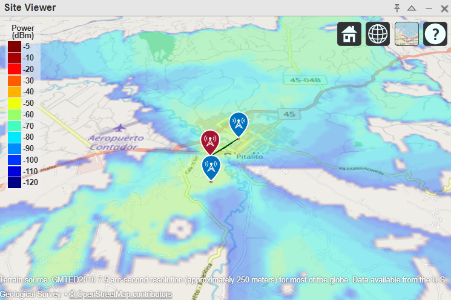
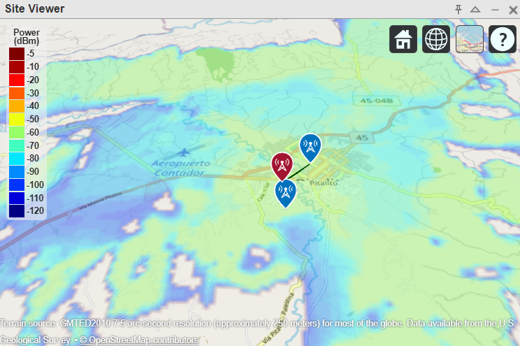

# Coverage Analysis and Transmission Systems

This repository contains MATLAB code for analyzing coverage and transmission systems using directive and omnidirectional transmitters.

## Directive Transmitter

### Overview
This section includes the setup for a directive transmitter located at the "Panorama" site in Pitalito, Huila. The goal is to analyze the coverage area and determine the inclination angles toward the receivers, "Isla" and "Centro."



### Code Highlights

1. **Receiver Definition:**
   - Two receiver sites, Isla and Centro, are defined with their respective geographical coordinates.
   - The transmitter's coordinates are also specified.

    ```matlab
    rxNames = ["Isla", "Centro"];
    rxLocations = [1.83444167 -76.05666667; 1.85257778 -76.04874444]; 
    txLocation = [1.84469167 -76.05725];
    ```

2. **Inclination Angle Calculation:**
   - The differences in latitude and longitude between the transmitter and the receivers are calculated to determine the tilt angles for the antenna.

    ```matlab
    latDiff = rxLocations(:,1) - txLocation(1);  
    lonDiff = rxLocations(:,2) - txLocation(2);  
    elevAngle = atan2d(latDiff, lonDiff);
    ```

3. **Antenna Configuration:**
   - A linear array antenna is designed, and the average tilt is applied to optimize the signal direction toward the receivers.

    ```matlab
    antenna = linearArray('Element', dipole, 'NumElements', 2, 'ElementSpacing', 0.5);
    avgTilt = mean(elevAngle);
    antenna.Tilt = avgTilt;
    ```

4. **Coverage Mapping:**
   - The coverage area is visualized using the Longley-Rice model, displaying the signal strength received by the two sites.

    ```matlab
    coverage(tx, "longley-rice", "SignalStrengths", rxSensitivity:5:-60);
    ```

## Omnidirectional Transmitter

### Overview
This section defines an omnidirectional transmitter also located at "Panorama." The focus is on mapping the coverage area and establishing communication links with mobile receivers.



### Code Highlights

1. **General Parameters:**
   - Key parameters such as frequency, transmitter power, and receiver sensitivity are defined for the omnidirectional system.

    ```matlab
    fq = 900e6;      
    txPower = 40;    
    rxSensitivity = -100; 
    ```

2. **Transmitter Configuration:**
   - The transmitter is set up with an omnidirectional dipole antenna, specifying its location and height.

    ```matlab
    tx = txsite("Name","Panorama", "Latitude",1.84469167, "Longitude",-76.05725, ...
                 "Antenna",design(dipole,fq), "AntennaHeight",10, ...
                 "TransmitterFrequency",fq, "TransmitterPower",txPower);
    ```

3. **Receiver Setup:**
   - The two mobile receivers are created with omnidirectional antennas, and their geographical locations are defined.

    ```matlab
    rxs = rxsite("Name",rxNames, "Latitude",rxLocations(:,1), ...
                 "Longitude",rxLocations(:,2), "Antenna",design(monopole,fq), ...
                 "ReceiverSensitivity",rxSensitivity);
    ```

4. **Coverage Analysis:**
   - Similar to the directive transmitter, the coverage area is visualized, showing the signal strength across the specified range.

    ```matlab
    coverage(tx,"PropagationModel","longley-rice", "SignalStrengths", rxSensitivity:5:-60);
    ```

### Conclusion
This repository allows for the analysis of different transmission systems' coverage capabilities using MATLAB. Users can adjust parameters and visualize results for both directive and omnidirectional transmission setups.
